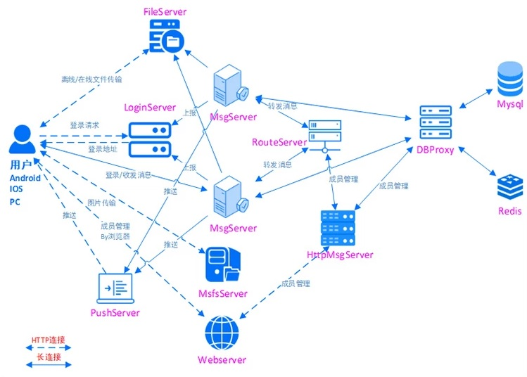

# 1. 简介
下载后参考《1-2 即时通讯项目编译和配置》搭建系统，这里README.MD有些图没能正常加载。


1. 零声教育即时通讯项目，基于开源项目TeamTalk二次开发。整个系统的架构设计如下：


2. TeamTalk目前的开源版本有较多的bug，功能也不够完善，零声学院始于TeamTalk但不止于TeamTalk，将会持续迭代改进该项目，最终开发成可以商业使用的版本。


# 2. 目录说明
```
|-- android  Android客户端（Android studio 3.2）
|-- auto_setup  启动目录
|-- doc    说明文档
|-- ios IOS客户端(新版本已经移除)
|-- LICENSE
|-- mac 苹果客户端
|-- pb protocol buffer包格式
|-- php Web后台管理
|-- server 服务器代码（centos7.0）
|-- win-client Windows客户端（vs2015编译）
```

# 3. 编译部署说明（Ubuntu 16.04环境）
分为一下几个步骤
1. 安装mysql、nginx、redis、php等常用组件
2. 编译im
3. 部署im服务器+web管理后台
安装方法如下所示

## 3.1 安装常用组件
### 3.1.1 安装mysql
1. **安装命令**
- 安装mysql服务器端
	>sudo apt-get -y install mysql-server
    
  **如果是ubuntu18.04则不会提示输入密码，默认是没有密码**
	配置root权限密码，然后按ok，根据提示再次输入密码即可


- 安装mysql客户端
	>sudo apt-get -y install mysql-client
- 安装mysql模块
	>sudo apt-get -y install libmysqlclient-dev

2. **验证是否成功**
	>sudo netstat -tap | grep mysql
	
      看到	

	或者用lsof查看数据库默认端口3306
	>sudo lsof -i:3306 
  
    看到

3. **进入mysql**
	>mysql -u root -p

如果是ubuntu18.04则以无密码的方式登录进去然后设置密码
```
sudo mysql -u root -p 直接按回车登录然后设置密码
mysql>use mysql;   然后敲回车(注意下面字母的大小写)
#  更新 plugin 及 authentication_string 字段，比如密码123456
mysql> UPDATE user SET plugin="mysql_native_password", authentication_string=PASSWORD("123456") WHERE user="root";
#　输出以下结果
Query OK, 1 row affected, 1 warning (0.00 sec)
Rows matched: 1  Changed: 1  Warnings: １
 
＃ 保存更新结果
mysql> FLUSH PRIVILEGES;
# 退出并重启 mysql
mysql> exit;
sudo service mysql restart
```
**需要特别注意的是ubuntu18.04版本在操作数据库的时候需要sudo权限**

4. **启动/停止/重启mysql**
	>service mysql start //启动mysql
service mysql restart //重新启动mysql
service mysql stop //关闭mysql


### 3.1.2 安装redis和 hiredis（如果已经有就不用再安装）
1. **命令安装**

	(1) 安装Redis,使用命令安装的只是2.83版本的，直接跳到**2.源码安装**
	>sudo apt-get -y install redis-server

	(2) 启动Redis
 	>sudo redis-server

	(3) 查看 redis 是否还在运行
	 >ps -ef | grep redis       --> 查看进程
	> netstat -an|grep 6379     --> redis的端口号是6379
	>redis-cli                --> 查看redis

	(4) 查看Redis 的版本
	>redis-server --version 或 redis-server -v 
	>
	(5) 卸载用命令安装的Redis
	>sudo apt-get remove redis-server
	>sudo apt list --installed | grep redis 看看还有没有余留
	>sudo apt-get remove redis-tools 余留了redis-cli等工具，一并卸载
	
2. **源码安装**
	(1) 下载到合适的位置，自己指定
	>wget http://download.redis.io/releases/redis-5.0.3.tar.gz  

	(2) 解压
	>tar -zxvf redis-5.0.3.tar.gz  
	
	(3) 编译
	>cd redis-5.0.3
	make
	
	(4) 编译安装依赖文件
	>cd deps
	make hiredis  linenoise lua jemalloc
	
	cd hiredis
	
	sudo make install
	
	cd ../lua
	
	sudo make install
	
	(5) 安装redis
	>cd ../../src
	sudo make install

	(6) 启动Redis
 	>sudo redis-server
    
	**ubuntu 18.04**使用
 	>sudo redis-server --daemonize yes

      然后用sudo lsof -i:6379 查看是否有监听相应的6379 端口
# 3.1.3 安装nginx
1. **安装nginx**
	(1)安装必要的第三方依赖包
	>sudo apt-get -y install libpcre3 libpcre3-dev
	sudo apt-get -y install zlib1g-dev
	sudo apt-get install openssl libssl-dev

	(2) 下载比较新的稳定版本，自己放到合适的位置
	> wget http://nginx.org/download/nginx-1.14.2.tar.gz
	
	(3) 解压配置编译安装
	> tar -zxvf nginx-1.14.2.tar.gz
	cd nginx-1.14.2
	./configure --prefix=/usr/local/nginx 
	make
	sudo make install
	
	安装后的执行文件路径：/usr/local/nginx/sbin/
	配置文件路径：/usr/local/nginx/conf/
	
	(4) 创建配置文件子目录和在nginx.conf中包含conf.d
	>sudo mkdir /usr/local/nginx/conf/conf.d
	
	修改/usr/local/nginx/conf/nginx.conf
	>sudo vim /usr/local/nginx/conf/nginx.conf
	
	末尾{之前添加
	>include /usr/local/nginx/conf/conf.d/*.conf;
	
	如图所示


2. **启动nginx**
	(1) 创建一个nginx.service
	   在 /lib/systemd/system/目录下面新建一个nginx.service文件。并赋予可执行的权限。
	>sudo vim /lib/systemd/system/nginx.service
	>sudo chmod +x /lib/systemd/system/nginx.service

	(2) 编辑service内容
	```
	[Unit]
	Description=nginx - high performance web server
	After=network.target remote-fs.target nss-lookup.target
	[Service]
	Type=forking
	ExecStart=/usr/local/nginx/sbin/nginx -c /usr/local/nginx/conf/nginx.conf
	ExecReload=/usr/local/nginx/sbin/nginx -s reload
	ExecStop=/usr/local/nginx/sbin/nginx -s stop
	[Install]
	WantedBy=multi-user.target
	```
	(3) 启动服务
     在启动服务之前，需要先重载systemctl命令
	>sudo systemctl daemon-reload
        >sudo systemctl start nginx.service 启动nginx	

    然后使用sudo ps -ef | grep nginx 查看是否有相应的进程

   常用命令
	>启动：sudo systemctl start nginx.service 
	>停止：sudo systemctl stop nginx.service 
	>重新加载：sudo systemctl reload nginx.service 	
	显示nginx服务的状态：systemctl status nginx.service
	在开机时启用nginx服务：sudo systemctl enable nginx.service
	在开机时禁用nginx服务：sudo systemctl disable nginx.service

## 3.1.4 安装php（ubuntu16.04版本）
（**如果是你是ubuntu18+版本直接看3.1.5**）
1. **命令安装**
  (1) 安装PHP7以及常用扩展
	>sudo apt-get -y install php7.0-fpm php7.0-mysql php7.0-common php7.0-mbstring php7.0-gd php7.0-json php7.0-cli php7.0-curl 
	
   	(2) 启动php7.0-fpm进程
	>sudo systemctl start php7.0-fpm

	(3）查看php7.0-fpm运行状态。
	>systemctl status php7.0-fpm 
	>或
	>/etc/init.d/php7.0-fpm status

	(4) 测试PHP是否安装成功
	>php -v
或
php --version

2. **修改php配置文件**
	(1) 修改www.conf
	>sudo vim /etc/php/7.0/fpm/pool.d/www.conf

	做如下处理（大概49行）
	注释掉
	>;listen.owner = www-data
;listen.group = www-data

	将mode值修改为0666
	>listen.mode = 0666


      
(2) 最后，执行sudo /etc/init.d/php7.0-fpm restart重启php-fpm服务

## 3.1.5 安装php（ubuntu18.04版本）
1. **命令安装**
  (1) 安装PHP7以及常用扩展
	>sudo apt-get -y install php7.2-fpm php7.2-mysql php7.2-common php7.2-mbstring php7.2-gd php7.2-json php7.2-cli php7.2-curl 
	
   	(2) 启动php7.2-fpm进程
	>sudo systemctl start php7.2-fpm

	(3）查看php7.2-fpm运行状态。
	>systemctl status php7.2-fpm 
	>或
	>/etc/init.d/php7.2-fpm status

	(4) 测试PHP是否安装成功
	>php -v
或
php --version

2. **修改php配置文件**
	(1) 修改www.conf
	>sudo vim /etc/php/7.2/fpm/pool.d/www.conf

	做如下处理（大概47行）
	注释掉
	>;listen.owner = www-data
;listen.group = www-data

	将mode值修改为0666
	>listen.mode = 0666


 (2) 最后，执行sudo /etc/init.d/php7.2-fpm restart重启php-fpm服务

## 3.2 编译IM
进入目录0voice_im/server/src

1. 编译protocol buffer库
> sudo ./make_protobuf.sh 

2. 编译日志log4
> sudo ./make_log4cxx.sh

3. 编译IM模块
> sudo ./build_ubuntu.sh version 1.0

4. 编译完成后返回上一级目录，即是回到0voice_im/server目录
>cd ..

此时多了im-server-1.0.tar.gz压缩包


将im-server-1.0.tar.gz拷贝到0voice_im/auto_setup/im_server
>cp im-server-1.0.tar.gz ../auto_setup/im_server/

# 3.3 部署IM+web管理后台
进入auto_setup，准备部署im

1. **导入teamtalk数据库**
注意数据库的密码和在安装mysql时候一致
在setup.sh里面修改数据库密码
	>cd auto_setup/mysql
	>vim setup.sh

	将数据库密码改为在mysql时配置的密码，我在配置时使用了123456，所以改为
	>MYSQL_PASSWORD=123456


导入数据库
  >sudo ./setup.sh install
	
导入成功的结果


也可以进入mysql做二次确认
  >mysql -u root -p
	>show databases;
	


2. **启动IM**
(1) 先配置模块配置文件
我们先单机部署，主要是修改msgserver.conf、dbproxyserver.conf和loginserver.conf
	>cd auto_setup/im_server

	修改auto_setup/im_server/conf目录的配置文件
	>vim conf/msgserver.conf
	
	将大概28行的IpAddr1和IpAddr2改为本机IP外网地址，如果是局域网部署则改为局域网ip，比如
	>IpAddr1=192.168.221.130 #电信IP
	IpAddr2=192.168.221.130 #网通IP
	
	修改访问db的密码
	>vim conf/dbproxyserver.conf
	
	
	修改loginserver.conf
	>vim conf/loginserver.conf
	>内容为：msfs=http://192.168.221.130:8700/
	
	其余不做修改
(2) 启动服务器模块	
	
	>sudo ./setup.sh install

	(3) 端口说明，可以使用sudo lsof -i:端口号（或者sudo netstat -tunlp查看所有端口） 查看相应进程是否起来
	- msg_server：消息服务器，用户登录成功后，就和指定的消息服务器交互。端口8000，需对外开放
	- login_server ：登录服务器，负责身份验证，负责给登录成功的客户端分配msg_server。
这个服务监听在两个端口，一个是tcp端口8100，用于和后端的服务器交互，另一个是http端口8080，需对外开放
	- route_server：消息转发，不同msg_server上用户交互需要中转站来转发消息。端口8200
	- http_msg_server：主要提供对外的web api，端口8400
	- push_server： 消息群发，端口8500
	- file_server：文件中转站，临时存储，端口8600
	- msfs：小文件永久存储，聊天的图片、表情等，端口8700，需对外开放
	- db_proxy_server：数据库中间件，后端为存储层，mysql和redis， 端口10600

3. **架设web管理后台**

	(1)  回到0voice_im目录，将php拷贝一份为tt压缩后拷贝到
0voice_im/auto_setup/im_web/
	>cd 0voice_im 回到根目录
		>cp -ar php tt
		>zip -r tt.zip tt
		>cp tt.zip auto_setup/im_web/
		>cd auto_setup/im_web

	(2) 修改web的配置文件，主要是ip地址和数据库用户名和密码以及nginx的配置
	 **ip地址修改**
	>vim conf/config.php 
		
	 修改为自己的外网地址
  ```
		$config['msfs_url'] = 'http://192.168.221.130:8700/';
		$config['http_url'] = 'http://192.168.221.130:8400';
  ```

 **数据库修改**
   > vim conf/database.php

 修改为：
```
	$db['default']['username'] = 'root';
	$db['default']['password'] = '123456';
```

**nginx配置**
 >vim conf/im.com.conf
	
将server_name 192.168.221.130;改为自己的ip地址，以及将php改成你对应的版本号（ubuntu18.x改为7.2）。


 (3) 部署web
 > sudo ./setup.sh install

 (4) 务必使用**谷歌浏览器**（其他浏览器有兼容性问题）打开服务器的ip地址，比如192.168.221.130，然后用户名和密码都为admin
	
登录进去后则可以配置部门和成员。
	比如添加c++部门和成员darren、king、lee，密码都为123456

添加组织架构

添加用户


4. **客户端登录**
已经编译好的客户端可执行文件路径：0voice_im_0721/win-client/bin/teamtalk/Release/0voice_im.exe，点击可以运行。


	


